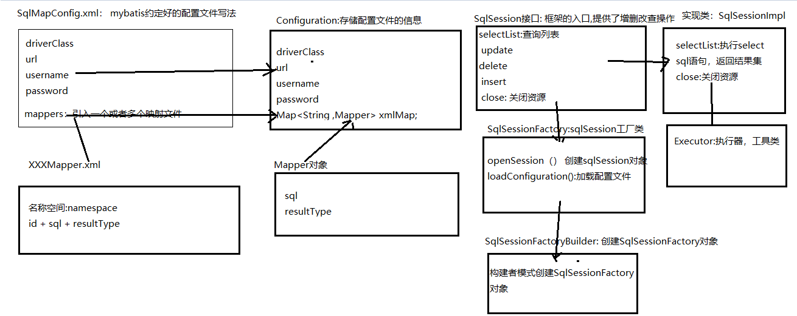

## Mybatis第一天

### 一、回顾

```
1. html + css +js ， jsp ,jquery ,ajax
2. servlet : 过滤器，监听器 
3. mysql ,redis
4. jdbc -- dbutils-- :持久层
5. 动态代理(jdk proxy动态代理，cglib动态代理)，静态代理
6. dom4J  解析xml
7. java web ,单张表的增删改查
```

### 二、内容介绍

1. 框架的介绍

2. 介绍mybatis框架

3. JDBC于Mybatis框架的比较

4. 自定义Mybatis框架

5. mybatis框架的快速入门


### 三、框架的介绍

##### 1、什么是框架

```
1. 半成品，
2. 饭店：买菜，油盐酱醋-- 洗菜 -- 炒菜--做饭 -- 刷锅，洗碗
```

##### 2、框架能解决什么问题

```
1、把技术封装起来
2、在开发中不应该考虑技术, 专注于逻辑（业务）开发
3, 框架时位于底层技术 和应用程序之间的代码
```

##### 3、三层架构中常用的框架

```
a、web：表现层: 处理用户请求和响应
		servlet -- struts(放弃) -- struts2(放弃) -- springMVC(主流)
b、service:业务层
		自己写业务 --- ejb -- spring(整合框架,业务)(不可取代)
c、dao: 持久层（数据接收对象）
		jdbc--dbutils--BeanUtils -- jdbcTemplate -- hibernate(放弃)--mybatis(主流)--spring data jpa(趋势)
		
		主流：整合： springmvc + spring + mybatis = ssm
		趋势：整合：springmvc + spring +spring data  = spring全家桶
```

### 四、mybatis框架的介绍

##### 1、jdbc中的代码

```
package com.itheima;

import com.itheima.domain.User;
import org.junit.Test;

import java.sql.*;
import java.util.ArrayList;
import java.util.List;

/**
 * 回顾jdbc代码
 */
public class TestJDBC {

    @Test
    public void test(){

        List<User> userList = new ArrayList<>();

        //1. 注册驱动
        try {
            Class.forName("com.mysql.jdbc.Driver");
        } catch (ClassNotFoundException e) {
            e.printStackTrace();
        }
        String url = "jdbc:mysql://localhost:3306/mybatisdb_331";
        String username = "root";
        String password = "root";
        Connection conn = null;
        PreparedStatement pst = null;
        ResultSet rs = null;
        try {
            //2. 获取连接
            conn = DriverManager.getConnection(url, username ,password);
            // 3. SQL语句
            String sql = "select * from user";
            //4. 创建statement对象: Statement , PreparedStatement
            pst = conn.prepareStatement(sql);
            //5. 执行SQL语句，返回结果集
            rs = pst.executeQuery();
            //6. 处理结果集
            while(rs.next()){//判断是否有下一条记录，如果有，说明有一个User对象
                User user = new User();
                //获取ResultSet中的值，赋值给user对象
                int id = rs.getInt("id");
                user.setId(id);
                user.setUsername(rs.getString("username"));
                user.setPassword(rs.getString("password"));
                user.setSex(rs.getString("sex"));
                user.setAddress(rs.getString("address"));
                //添加到集合中
                userList.add(user);
            }
        } catch (SQLException e) {
            e.printStackTrace();
        } finally {
            //7. 释放资源: 先开后关
            if(rs != null){
                try {
                    rs.close();
                } catch (SQLException e) {
                    e.printStackTrace();
                }
            }
            if(pst != null){
                try {
                    pst.close();
                } catch (SQLException e) {
                    e.printStackTrace();
                }
            }
            if(conn != null){
                try {
                    conn.close();
                } catch (SQLException e) {
                    e.printStackTrace();
                }
            }

        }

        //打印结果
        for (User user : userList) {
            System.out.println(user);
        }

    }
}

```

#####    2、jdbc代码中的问题

```
a、频繁创建和释放数据库的连接对象，造成资源的浪费. 使用数据库连接池可以解决（c3p0 ,dbcp, spring jdbc ,durid）
b、sql语句硬编码(写死),如果数据库发生改变，需要重新编译代码，再运行 。 可以考虑把sql语句写到配置文件中
c、传参数硬编码，必须按照特定的顺序传参
d、处理结果集硬编码，如果改变了数据库，结果集的映射必须重新写，需要重新编译代码，再运行
e、连接的配置信息硬编码
```

#####    3、mybatis框架的概述

```

```

### 五、自定义框架（原理）	

	

### 六、Mybatis框架的快速入门（重点）

##### 1、添加依赖(jar)

```xml
 <dependency>
            <groupId>org.mybatis</groupId>
            <artifactId>mybatis</artifactId>
            <version>3.4.5</version>
        </dependency>
        <dependency>
            <groupId>mysql</groupId>
            <artifactId>mysql-connector-java</artifactId>
            <version>5.1.6</version>
        </dependency>
        <dependency>
            <groupId>junit</groupId>
            <artifactId>junit</artifactId>
            <version>4.12</version>
        </dependency>
```

##### 2、编写pojo对象

```java
package com.itheima.domain;

/**
 * 包装类型： 初始值为null
 * 基本数据类型：本身的值就是一个状态
 *
 */
public class User {
    private Integer id;
    private String username;
    private String password;
    private String sex;
    private String address;

    public Integer getId() {
        return id;
    }

    public void setId(Integer id) {
        this.id = id;
    }

    public String getUsername() {
        return username;
    }

    public void setUsername(String username) {
        this.username = username;
    }

    public String getPassword() {
        return password;
    }

    public void setPassword(String password) {
        this.password = password;
    }

    public String getSex() {
        return sex;
    }

    public void setSex(String sex) {
        this.sex = sex;
    }

    public String getAddress() {
        return address;
    }

    public void setAddress(String address) {
        this.address = address;
    }

    @Override
    public String toString() {
        return "User{" +
                "id=" + id +
                ", username='" + username + '\'' +
                ", password='" + password + '\'' +
                ", sex='" + sex + '\'' +
                ", address='" + address + '\'' +
                '}';
    }
}

```

##### 3、编写映射文件

```xml
<?xml version="1.0" encoding="utf-8" ?>
<!DOCTYPE mapper
        PUBLIC "-//mybatis.org//DTD Mapper 3.0//EN"
        "http://mybatis.org/dtd/mybatis-3-mapper.dtd">
<mapper namespace="com.itheima.dao.UserDao">
    <select id="findAll" resultType="com.itheima.domain.User">
        select * from user
    </select>
</mapper>
```

##### 4、编写核心配置文件

```xml
<?xml version="1.0" encoding="UTF-8" ?>
<!DOCTYPE configuration
        PUBLIC "-//mybatis.org//DTD Config 3.0//EN"
        "http://mybatis.org/dtd/mybatis-3-config.dtd">
<configuration>
    <environments default="development">
        <environment id="development">
            <transactionManager type="JDBC" />
            <dataSource type="POOLED">
                <property name="driver" value="com.mysql.jdbc.Driver" />
                <property name="url" value="jdbc:mysql://127.0.0.1:3306/mybatisdb_331?characterEncoding=utf8" />
                <property name="username" value="root" />
                <property name="password" value="root" />
            </dataSource>
        </environment>
    </environments>
    <!--关联映射文件-->
	<mappers>
		<mapper resource="com/itheima/mapper/UserMapper.xml"></mapper>
    </mappers>
</configuration>    
```

##### 5、测试框架

```java
package com.itheima;


import org.apache.ibatis.session.SqlSession;
import org.apache.ibatis.session.SqlSessionFactory;
import org.apache.ibatis.session.SqlSessionFactoryBuilder;
import org.junit.Test;

import java.io.InputStream;
import java.util.List;

public class TestCustomFrame {

    @Test
    public void test(){
        //获取配置文件的输入流对象
        InputStream inputStream = this.getClass().getClassLoader().getResourceAsStream("SqlMapConfig.xml");
        //创建SqlSessionFactoryBuilder对象
        SqlSessionFactoryBuilder sqlSessionFactoryBuilder = new SqlSessionFactoryBuilder();
        //创建SqlSessionFactory对象
        SqlSessionFactory sessionFactory = sqlSessionFactoryBuilder.build(inputStream);
        //获取sqlSession对象
        SqlSession sqlSession = sessionFactory.openSession();
        //执行sql语句
        List list = sqlSession.selectList("com.itheima.dao.UserDao.findAll");
        //遍历结果集
        for (Object o : list) {
            System.out.println(o);
        }
        //关闭资源
        sqlSession.close();
    }
}

```

### 七、总结

```

```

