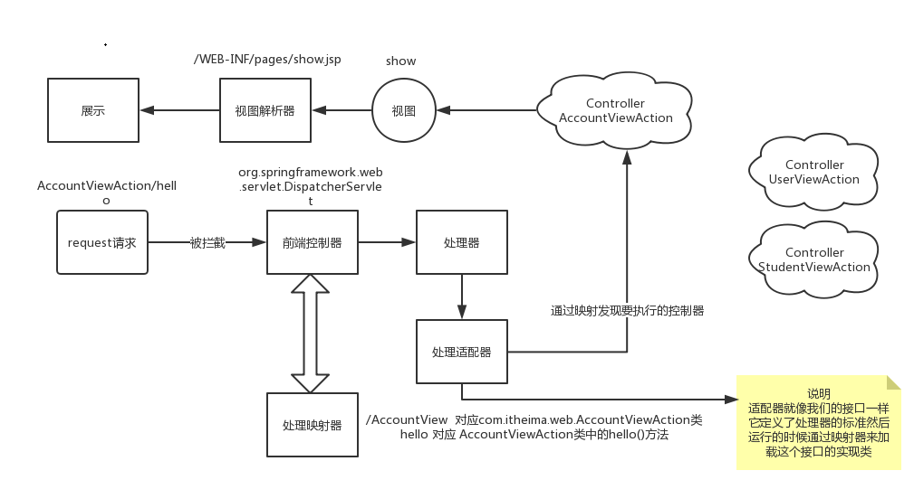

## SpringMVC第一天

#### 一、知识回顾

```
1. mybatis: 持久层轻量级开源框架
		crud , 一对一映射，一对多，多对多，延迟加载(懒加载:lazy)，缓存（一级缓存:sqlSession级别，二级缓存:SqlSessionFactory级别（应用级别））：xml和注解实现
2. spring: 表现在业务层，解耦和事务管理
	两大核心：IOC：控制反转，包含了依赖注入和依赖查找
				   AOP： 面向切面编程（面向多个对象编程 ）引用：声明式事务管理，日志管理，spring security安全框架
				 aop中的重点：声明式事务管理 -- xml ，ann  
		
```

#### 二、三层架构和MVC设计模式

```
a、三层架构
	web层-- 表现层: 处理用户的请求和相应
		技术：servlet
	service层:业务层, 编写业务，处理业务逻辑，编写事务
		技术：spring
	dao层：持久层，数据的增删改查
		技术：jdbc -- dbutils -- jdbcTemplate -- mybatis(主流) -- spring data jpa（趋势）
b、mvc设计模式
	M:model --模型： pojo类，封装数据 , 广义上说：dao + service + model = 业务模型层
	V:view -- 视图: jsp,html,freemarker:展示数据, 广义上讲：只要能展示数据就是视图
	C:cotroller --控制层:servlet ：处理用户的请求和相应
```

#### 三、springMVC的概念

```
1. springMVC是spring体系中的一个子项目
2. springMVC是开源的轻量级框架
3. springMVC是满足了mvc设计的模式的一个表现层框架
4. 表现层框架大多都满足了MVC设计模式
```

#### 四、SpringMVC的HelloWorld(重点)

##### 1、引入依赖

```
<!--spring的核心-->
    <dependency>
      <groupId>org.springframework</groupId>
      <artifactId>spring-context</artifactId>
      <version>5.0.2.RELEASE</version>
    </dependency>
    <!--springMVC的jar包-->
    <dependency>
      <groupId>org.springframework</groupId>
      <artifactId>spring-webmvc</artifactId>
      <version>5.0.2.RELEASE</version>
    </dependency>
    <!-- servlet-api -->
    <dependency>
      <groupId>javax.servlet</groupId>
      <artifactId>servlet-api</artifactId>
      <version>2.5</version>
      <!--
        maven 项目执行分为三个阶段
          编译(需要)  测试(需要)  运行(不需要)
          provided : 编译器生效，测试生效，运行不生效

         servlet-api ,jsp-api:这两个包，需要配置依赖范围为provided ，其他都不需要
      -->
      <scope>provided</scope>
    </dependency>
    <dependency>
      <groupId>javax.servlet</groupId>
      <artifactId>jsp-api</artifactId>
      <version>2.0</version>
      <scope>provided</scope>
    </dependency>
```

##### 2、spring-mvc.xml配置

```
<?xml version="1.0" encoding="UTF-8"?>
<beans xmlns="http://www.springframework.org/schema/beans"
       xmlns:xsi="http://www.w3.org/2001/XMLSchema-instance"
       xmlns:context="http://www.springframework.org/schema/context"
       xsi:schemaLocation="http://www.springframework.org/schema/beans http://www.springframework.org/schema/beans/spring-beans.xsd http://www.springframework.org/schema/context http://www.springframework.org/schema/context/spring-context.xsd">

    <!--开启注解，扫描包-->
    <context:component-scan base-package="com.itheima"></context:component-scan>
</beans>
```

##### 3、web.xml配置

```
<!--配置servlet:前端控制器-->
  <servlet>
    <servlet-name>DispatcherServlet</servlet-name>
    <servlet-class>org.springframework.web.servlet.DispatcherServlet</servlet-class>
    <!--servlet中配置局部参数：读取配置文件-->
    <init-param>
      <param-name>contextConfigLocation</param-name>
      <param-value>classpath:spring-mvc.xml</param-value>
    </init-param>
  </servlet>
  <servlet-mapping>
    <servlet-name>DispatcherServlet</servlet-name>
    <url-pattern>/</url-pattern>
  </servlet-mapping>
```

##### 4、自定义核心控制类 

```

@Controller
public class TestController {

    @RequestMapping("/test")
    public void test(){
        System.out.println("helloWorld--测试成功");
    }

}
```

##### 5、页面配置

```
<a href="${pageContext.request.contextPath}/test">请求1</a>
<a href="/test">请求2</a>
```

#### 五、入门案例的执行过程及原理分析

	

#### 六、@RequestMapping注解(重点)

```
1. @RequestMapping 请求路径映射,该注解可以标记在方法上，也可以标记在类上
   标记在类上用来窄化路径
2. 属性
	path：指定请求路径，别名value，所以属性名可以省略
	method: 请求方式: 
		get: 路径和超链接请求都是get请求
		post: 必须在表单中实现
	params:声明请求路径的规则 -- 了解
		"name":路径中必须有name
		"age>20":路径中必须有age>20
		"!name" :路径中不存在name
```

#### 七、参数的绑定(重点)

```
1. 表单中提交的name值与方法中的参数（简单类型）名称一致，就可以直接获取到
2. 方法的参数：pojo类型
	只要保证表单提交的name值与pojo的属性名一致，就可以封装数据
3. @RequestParam：请求参数绑定,name与参数名不一致
	属性： value, name可以指定页面表单中的name值
	requird: 是否必须的  , false ，不必要的（可有可无）, true:必须有该参数
	defaultValue: 默认值，如果页面传参了，则使用页面传参的值，如果没有指定，则使用默认值
4. 特殊情况：（自定义类型转换器）要转换类型是Date类型
	1）自定义类型转换类
	/**
 *
 * 自定义类型转换器
 *      将字符串格式转换为日期格式
 *      1. 实现接口converter<S,T>
 *                S：源类型 -- String
 *                T：目标类型-- Date
 * @author 黑马程序员
 * @Company http://www.ithiema.com
 * @Version 1.0
 */
public class StringToDateConverter implements Converter<String ,Date>{
    /**
     * 类型转换方法
     * @param source  源
     * @return  目标
     */
    @Override
    public Date convert(String source) {
        //日期类型的转换对象
        SimpleDateFormat sdf = new SimpleDateFormat("yyyy/MM/dd");
        Date date = null;
        try {
            date = sdf.parse(source);
        } catch (ParseException e) {
            e.printStackTrace();
        }
        return date;
    }
}
2. 在springmvc.xml文件中配置类型转换工厂
<!--类型转换工厂-->
    <bean id="conversionService" class="org.springframework.context.support.ConversionServiceFactoryBean">
        <property name="converters">
            <set>
                <bean class="com.itheima.converter.StringToDateConverter"></bean>
            </set>
        </property>
    </bean>
3. 在注解驱动中引入类型转换工厂
 		<!--注解驱动: 关联类型转换工厂-->
    <mvc:annotation-driven conversion-service="conversionService"></mvc:annotation-driven>
```

#### 八、编码过滤器(重点)

```
<!--编码过滤器-->
  <filter>
    <filter-name>CharactorEncoding</filter-name>
    <filter-class>org.springframework.web.filter.CharacterEncodingFilter</filter-class>
    <!--配置初始化参数，指定编码格式:拦截的是post请求-->
    <init-param>
      <param-name>encoding</param-name>
      <param-value>utf-8</param-value>
    </init-param>
    <!--
      指定请求编码格式和相应编码格式: 了解，一般不用指定
    -->
    <init-param>
      <param-name>forceEncoding</param-name>
      <param-value>true</param-value>
    </init-param>
  </filter>
  <filter-mapping>
    <filter-name>CharactorEncoding</filter-name>
    <!--拦截所有的请求：不包含静态资源的-->
    <url-pattern>/*</url-pattern>
  </filter-mapping>
  
```

#### 九、总结

```

```

